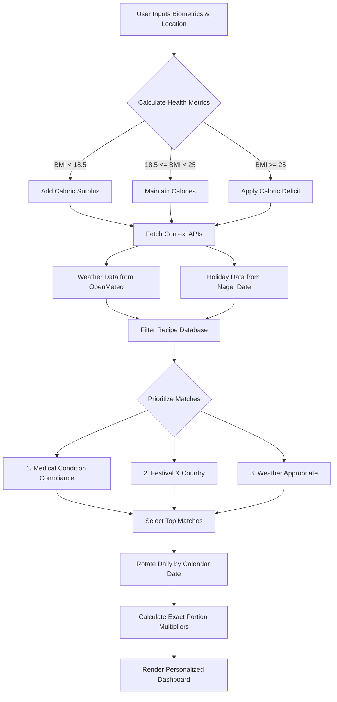

# Context-Aware Vegetarian Meal Planner 🥗

A highly personalized, intelligent web application designed to generate vegetarian meal plans tailored not just to your health biometrics, but to your real-world environment. 

By analyzing your location, local weather, regional holidays, and medical constraints, this app serves a fully customized daily meal plan with exact macronutrient and caloric targets.

## ✨ Features

- **Biometric Health Optimization**: Calculates BMI and Total Daily Energy Expenditure (TDEE). Automatically adjusts targets for weight loss (caloric deficit) or healthy weight gain based on user data.
- **Age-Adjusted Protein Targets**: Dynamically calculates and increases protein requirements for senior users to help prevent age-related muscle loss.
- **Medical & Dietary Filters**: Allows users to input medical conditions (e.g., Diabetes, Hypertension, Celiac) and strictly filters the recipe database for safe, compliant meals (like Gluten-Free or Low Sodium options).
- **Environmental Context**: 
  - Connects to the **OpenMeteo API** to check your city's current weather, suggesting warm meals on cold days and lighter meals on hot days.
  - Connects to a **Public Holiday API** via your country code to recommend special festive meals (e.g., *Chilaquiles* on Cinco de Mayo, or *Biryani* for Diwali).
- **Culturally Relevant**: Prioritizes recipes authentic to your selected region (e.g., entering "IT" serves Pasta Primavera, "IN" serves Palak Paneer).
- **Exact Servings**: Recommends exact fractional serving sizes (e.g., "1.2 Servings") to perfectly hit your macro goals.

## 📁 Project Structure

```text
vegetarian-meal-planner/
├── index.html     # Main user interface and form
├── styles.css     # Premium styling and design system
├── app.js         # Core application logic and API integration
├── meals_db.js    # Static database of vegetarian recipes
└── README.md      # Project documentation
```

## 📂 Architecture & File Flow



The application is built using a modern, lightweight, no-build vanilla stack (HTML/CSS/JS) to ensure maximum performance and portability.

### `index.html`
The core structure of the application. 
- Contains the beautiful, responsive glassmorphism user interface.
- Hosts the personalization form for user biometrics, location, and medical constraints.
- Includes a dynamic hidden `template` element used by JavaScript to inject the final customized meal cards.

### `styles.css`
The design system of the application.
- Utilizes CSS variables for quick theming and a cohesive color palette (Emerald green and Amber accents over a Slate dark mode).
- Implements modern UI paradigms including blur backdrops (`backdrop-filter: blur`), smooth micro-animations on hover, and fully responsive media queries for mobile and desktop viewing.

### `app.js`
The "brain" of the meal planner. The logical flow is as follows:
1. **Data Collection**: Reads all biometric and contextual inputs upon form submission.
2. **Health Math**: Calculates BMR (Mifflin-St Jeor), TDEE, BMI, and the age-adjusted Protein Target. Sets caloric deficits/surpluses.
3. **API Fetching**: Makes asynchronous calls to external weather and holiday APIs.
4. **Algorithmic Filtering (`filterMeals`)**: Passes the meal database through strict medical filters (Priority 0), festival matches (Priority 1), country matches (Priority 2), and weather matching (Priority 3).
5. **Selection & Scaling**: Picks the optimal meals that come closest to your caloric distribution (Breakfast/Lunch/Dinner) and calculates exact serving multipliers to hit the exact target.
6. **DOM Manipulation**: Clones the HTML template, populates it with the calculated data, and renders the dynamic dashboard.

### `meals_db.js`
A static, offline-first JSON database of curated vegetarian recipes.
- Each recipe contains metadata for macros (calories, protein, carbs, fat).
- Contains context tags mapping recipes to specific weather conditions, festivals, target countries, and medical compliance labels (`safeFor`).

## 🚀 How to Run Locally

Because the app utilizes local modules and API fetches, it is recommended to run it via a local development server to avoid CORS issues.

1. Ensure you have Python installed.
2. Open a terminal in the root directory of this project.
3. Run the following command:
   ```bash
   python -m http.server 8080
   ```
4. Open your web browser and navigate to: `http://localhost:8080`
