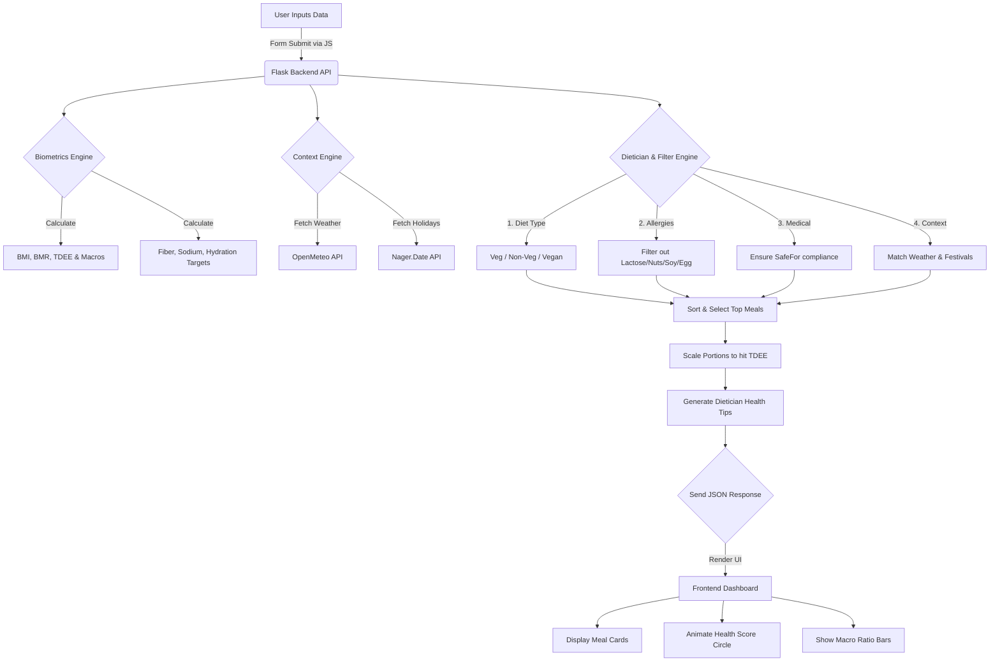

# V-Planner: Context-Aware Personalized Meal Planner 🥗

A highly personalized, intelligent full-stack web application designed to generate vegetarian, non-vegetarian, and vegan meal plans tailored to your health biometrics, medical constraints, and real-world environment. 

By analyzing your location, local weather, regional holidays, allergies, and medical conditions, this app serves a fully customized daily meal plan with exact macronutrient targets and a comprehensive dietician health analysis.

## ✨ Features and Use Cases

- **Complete Diet Support**: Supports strictly filtered Vegetarian, Non-Vegetarian, and Vegan diet plans.
- **Biometric Health Optimization**: Calculates BMI, Total Daily Energy Expenditure (TDEE), and Macro Ratios. Automatically adjusts caloric targets for weight loss or healthy weight gain based on user data.
- **Dietician Health Analysis**: Provides a dynamic "Health Score" circle, macro ratio bars, fiber/sodium tracking, hydration goals, and clinically-relevant advice for 14 different medical conditions.
- **Medical & Allergen Filters**: Allows users to input medical conditions (e.g., Diabetes, Hypertension, Celiac) and allergies (Lactose, Nuts, Soy, Egg), strictly filtering the database for safe, compliant meals.
- **Environmental Context**: 
  - Connects to the **OpenMeteo API** to check your city's current weather, suggesting warm meals on cold days and lighter meals on hot days.
  - Connects to a **Public Holiday API** to recommend special festive meals (e.g., *Biryani* for Diwali or Eid).
- **Live Recipe Integration**: Optionally connects to the **Spoonacular API** to fetch thousands of live, dynamic recipes if an API key is provided.
- **Exact Servings**: Recommends fractional serving sizes (e.g., "1.2 Servings") to perfectly hit your macro goals.

## 🛠️ How We Made This (Architecture)

V-Planner is built using a modern **Python (Flask)** backend and a vanilla **HTML/CSS/JS** frontend. This architecture allows complex health algorithms and API fetching to run securely on the server, while the frontend handles the premium, glassmorphism-style reactive UI.

### 📁 Project Structure

```text
vegetarian-meal-planner/
├── app.py                 # Flask Server: Routing, APIs, and Health algorithms
├── meals.json             # Database of recipes with macro & context metadata
├── requirements.txt       # Python dependencies (Flask, Requests, Flask-CORS)
├── static/
│   ├── css/styles.css     # Premium styling, glassmorphism, animations
│   └── js/app.js          # Frontend UI logic, form handling, and DOM rendering
└── templates/
    └── index.html         # Main user interface template (Jinja2)
```

## 📂 Logical Flow & Diagram



## 🚀 How to Run Locally

1. **Install Python 3.x** on your machine.
2. **Clone the repository** and navigate to the project root directory.
3. **Install Dependencies**:
   ```bash
   pip install -r requirements.txt
   ```
4. **Run the Flask Server**:
   ```bash
   python app.py
   ```
5. **Open your browser** and navigate to: `http://127.0.0.1:5000`
